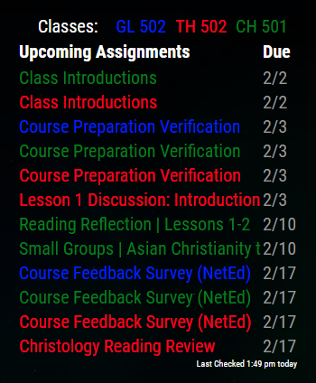

# MagicMirror Canvas
This is a module for `MagicMirror²` which displays upcoming assignments from the Canvas LMS. The Canvas LMS is used by colleges, universities and other institutions for coursework.

## Installation
1.  Clone this repository into your MagicMirror `modules` folder.
```
cd /MagicMirror/modules
git clone https://github.com/dbeltjr/MMM-Canvas.git
cd MMM-Canvas
npm install
```
2.  Edit your configuration file under `config/config.js` with the following configuration.
```
{
  module: "MMM-Canvas",
  position: "top_right",
  config: {
    accessKey: "",
    colors: ["blue", "red",],
    courses: ["12345","67890",],
    courseDesignators: ["EN 101", "MT 210"],
    urlbase: "elearning.university.edu",
    assignMaxLen: 35,
    assignToDisplay: 3,
    overdueDays: 7,
  }
},
```
3. Get an API key for accessKey in your Canvas account. To do this, login and go to Account -> Profile -> Settings -> Create a new access token.
4. Input the correct Canvas url in `urlbase`. This should be the same as the url of the dashboard page of canvas. DO NOT include a trailing slash (`/`) or `https://www.`.
5. Fill the courses array with the courses you want to check for assignments from. On each course's homepage the url will be elearning.university.edu/courses/courseId. Use courseId.
6. (Optional) To color code the courses, put in colors in the colors array in the corresponding order with the courses array. This array accepts all CSS color values [CSS Colors](https://www.w3schools.com/colors/default.asp). I reccomend using the color names for clarity.
7. (Optional) To designate the course short title in the legend, Enter it in the same order as the "courses:" config line
8. (Optional) assignMaxLen will keep assignments from displaying too long, and assignToDisplay changes the number of upcoming assignments to show.
9. Legend above the list is centered, but the CSS may need to be adjusted with either a margin-right or margin-left depending on where the module is placed.
```
.legend-item {
    margin-right: 10px;
    margin-left: 10px;
}
```
10. (Optional) By default assignments beyond 7 days overdue will drop off the list. This can be changed to any number of days.
### Preview



#### Credits
MagicMirror²:   [MagicMirror²](https://github.com/MichMich/MagicMirror)   
Based heavily on the MMM-Lice (Live International Currency Exchange) module by mkyle1
MMM-LICE:    [MMM-LICE](https://github.com/mykle1/MMM-LICE)
CanvasAPI:  [CanvasAPI](https://canvas.instructure.com/doc/api/index.html)

Original MMM-Canvas  [chase-cromwell/MMM-Canvas](https://github.com/chase-cromwell/MMM-Canvas)
